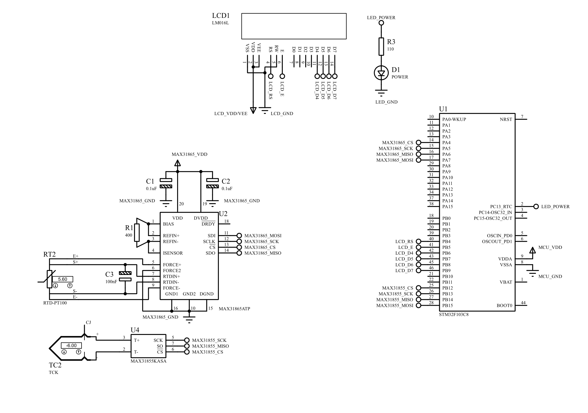

# Industrial Heater Control Module


A high-reliability industrial heater controller designed for precise thermal management and safety-critical combustion control, built on the STM32F103C8T6 microcontroller.

## 📋 Table of Contents
- [Overview](#overview)
- [Features](#features)
- [Hardware Components](#hardware-components)
- [Pin Configuration](#pin-configuration)
- [Software Architecture](#software-architecture)
- [Project Structure](#project-structure)
- [Getting Started](#getting-started)
- [Building the Project](#building-the-project)
- [Usage](#usage)
- [Safety Features](#safety-features)
- [Documentation](#documentation)
- [Development](#development)
- [License](#license)

## 🎯 Overview

The Smart Heater Module is an industrial-grade thermal controller leveraging DMA (Direct Memory Access) and interrupt-driven architecture to ensure safe, real-time operation without CPU blocking. The system manages dual temperature sensing, relay control, LCD user interface, and Modbus RTU communication.

**Key Specifications:**
- **Microcontroller:** STM32F103C8T6 (ARM Cortex-M3, 72MHz)
- **Temperature Range:** 
  - Ambient: -50°C to +250°C (PT100)
  - Furnace: 0°C to +1350°C (K-Type Thermocouple)
- **Communication:** RS485 (Modbus RTU)
- **Display:** 16x2 LCD Character Display
- **Power:** 5V/3.3V Logic

## ✨ Features

### Temperature Sensing
- **PT100 RTD Sensor** via MAX31865
  - High-precision ambient temperature monitoring
  - DMA-based continuous reading
  - Fault detection and error handling
  - Calibration support

- **K-Type Thermocouple** via MAX31855
  - Furnace temperature monitoring up to 1350°C
  - Built-in cold-junction compensation
  - Open/short circuit detection
  - DMA-optimized data acquisition

### Control Systems
- **Dual Relay Control**
  - Furnace/Gas relay (safety-critical)
  - Fan relay with feedback monitoring
  
- **Safety Mechanisms**
  - Hardware-based fan failure detection via EXTI
  - Independent watchdog timer (IWDG)
  - Window watchdog (WWDG)
  - Fail-safe relay shutdown

### Communication
- **RS485 Interface**
  - Modbus RTU protocol support
  - DMA with idle line detection
  - Half-duplex with direction control (DE/RE)
  
- **USB Interface**
  - Debugging and firmware updates
  - Device configuration

### User Interface
- **16x2 LCD Display**
  - Real-time temperature display
  - System status indicators
  - Non-blocking state machine operation
  
- **Button Controls**
  - Menu navigation (MENU_BTN)
  - Selection confirmation (ENTER_BTN)
  - Up/Down controls

### Status Indicators
- **LED Status Display**
  - **Power LED (PC13):** System power and heartbeat indicator
  - **Fault LED (PA0):** Red LED for error/fault conditions
  - **Communication LED (PA8):** Blinks during RS485 activity
  - **VC Relay Status:** Indicated by relay state (PB0)
  - **Gas/Furnace Status:** Indicated by relay state (PB1)
  - **Fan Status:** Indicated by relay state (PB2)

## 🔧 Hardware Components

| Component | Part Number | Purpose | Interface |
|-----------|-------------|---------|-----------|
| MCU | STM32F103C8T6 | Main Controller | - |
| RTD Converter | MAX31865 | PT100 Temperature Sensing | SPI1 (DMA) |
| Thermocouple Amp | MAX31855 | K-Type Temperature Sensing | SPI2 (DMA) |
| RS485 Transceiver | Generic | Modbus Communication | USART2 (DMA) |
| LCD Display | HD44780 Compatible | User Interface | GPIO (4-bit mode) |
| Crystal Oscillator | 8MHz | System Clock | HSE |
| Status LEDs | Standard LEDs | Visual Status Indicators | GPIO |

### Circuit Diagram

For complete circuit schematic and connections, see:
- **Circuit Diagram:** [heater_module.svg](simulation/heater_module.svg)
- **Proteus Project:** [heater_module.pdsprj](simulation/heater_module.pdsprj)



## 📌 Pin Configuration

### SPI1 (MAX31865 - PT100)
| Pin | Function | Description |
|-----|----------|-------------|
| PA4 | MAX31865_CS | Chip Select |
| PA5 | MAX31865_SCK | SPI Clock |
| PA6 | MAX31865_MISO | Data In |
| PA7 | MAX31865_MOSI | Data Out |

### SPI2 (MAX31855 - Thermocouple)
| Pin | Function | Description |
|-----|----------|-------------|
| PB12 | MAX31855_CS | Chip Select |
| PB13 | MAX31855_SCK | SPI Clock |
| PB14 | MAX31855_MISO | Data In |

### USART2 (RS485)
| Pin | Function | Description |
|-----|----------|-------------|
| PA1 | RS485_DE | Direction Enable |
| PA2 | RS485_TX | Transmit |
| PA3 | RS485_RX | Receive |

### LCD (16x2)
| Pin | Function | Description |
|-----|----------|-------------|
| PB5 | LCD_RS | Register Select |
| PB6 | LCD_E | Enable |
| PB7 | LCD_D4 | Data Bit 4 |
| PB8 | LCD_D5 | Data Bit 5 |
| PB9 | LCD_D6 | Data Bit 6 |
| PB15 | LCD_D7 | Data Bit 7 |

### Control & Safety
| Pin | Function | Description |
|-----|----------|-------------|
| PB1 | FURNACE_RELAY | Gas/Heater Control |
| PB2 | FAN_RELAY | Fan Control |
| PB0 | VC_MONITOR | Fan Voltage/Current Monitor (EXTI) |
| PA9 | MENU_BTN | Menu Button (EXTI) |
| PA10 | ENTER_BTN | Enter Button (EXTI) |
| PB10 | UP_BTN | Increment Button |
| PB11 | DOWN_BTN | Decrement Button |

### Status LEDs
| Pin | Function | Description |
|-----|----------|-------------|
| PC13 | LED_POWER | Power/Heartbeat LED (Active Low) |
| PA0 | LED_FAULT | Fault/Error Indicator (Red) |
| PA8 | LED_COM | Communication Activity Indicator |

**Note:** Gas valve and fan status can be indicated by LEDs connected in parallel with relay outputs (PB1 and PB2).

### Debug
| Pin | Function | Description |
|-----|----------|-------------|
| PA13 | SWDIO | Debug Data |
| PA14 | SWCLK | Debug Clock |

## 🏗️ Software Architecture

### DMA-Based Sensor Acquisition
The system implements a "ping-pong" circular DMA sequence to maximize SPI bus efficiency:

```
[Timer/Main Loop] → [PT100 Read] → [DMA Complete IRQ] → [Thermocouple Read] → [DMA Complete IRQ] → [PT100 Read] → ...
```

**Benefits:**
- Zero CPU overhead during data transfer
- Deterministic timing
- Automatic sensor chaining
- Error recovery without blocking

### Interrupt Priority Matrix (NVIC)

| IRQ Source | Priority | Purpose |
|------------|----------|---------|
| HardFault / NMI | 0 (Highest) | Critical system faults |
| Memory Management | 1 | Memory protection |
| Bus Fault | 2 | Bus access errors |
| Usage Fault | 3 | Undefined instruction/illegal state |
| SVCall | 4 | System service calls |
| Debug Monitor | 5 | Debug events |
| PendSV | 7 | Pendable service request |
| WWDG | 8 | Window watchdog timeout |
| USART2_RX DMA (Ch6) | 9 | RS485 receive DMA |
| USART2 | 9 | RS485 UART interrupt |
| USART2_TX DMA (Ch7) | 10 | RS485 transmit DMA |
| EXTI0 (VC Monitor) | 11 | Fan voltage/current monitor |
| SPI1_RX DMA (Ch2) | 12 | PT100 sensor DMA |
| SPI2_RX DMA (Ch4) | 12 | Thermocouple sensor DMA |
| SPI1_TX DMA (Ch3) | 13 | PT100 transmit DMA |
| EXTI9 (MENU_BTN) | 14 | Menu button |
| EXTI10 (ENTER_BTN) | 14 | Enter button |
| SysTick | 15 (Lowest) | System tick for HAL |

### Status Flags
```c
#define STATUS_SPI_ERROR         (1 << 0)
#define STATUS_SPI_BUSY          (1 << 1)
#define STATUS_SPI_TIMEOUT       (1 << 2)
#define STATUS_AMBIENT_ERROR     (1 << 3)
#define STATUS_FURNACE_ERROR     (1 << 4)
#define STATUS_AMBIENT_READING   (1 << 5)
#define STATUS_FURNACE_READING   (1 << 6)
```

## 📁 Project Structure

```
heater_module/
├── Core/
│   ├── Inc/                      # Header files
│   │   ├── main.h               # Main application header
│   │   ├── spi.h                # SPI configuration
│   │   ├── usart.h              # USART configuration  
│   │   ├── usb.h                # USB configuration
│   │   ├── gpio.h               # GPIO configuration
│   │   ├── dma.h                # DMA configuration
│   │   ├── iwdg.h               # Independent watchdog
│   │   ├── wwdg.h               # Window watchdog
│   │   ├── stm32f1xx_hal_conf.h # HAL configuration
│   │   └── stm32f1xx_it.h       # Interrupt handlers header
│   └── Src/                     # Source files
│       ├── main.c               # Main application (user code)
│       ├── spi.c                # SPI initialization
│       ├── usart.c              # USART initialization
│       ├── usb.c                # USB initialization
│       ├── gpio.c               # GPIO initialization
│       ├── dma.c                # DMA initialization
│       ├── iwdg.c               # Independent watchdog init
│       ├── wwdg.c               # Window watchdog init
│       ├── stm32f1xx_it.c       # Interrupt handlers
│       ├── stm32f1xx_hal_msp.c  # HAL MSP initialization
│       ├── system_stm32f1xx.c   # System initialization
│       ├── syscalls.c           # System calls for newlib
│       └── sysmem.c             # Memory management
├── Drivers/                     # STM32 HAL drivers
│   ├── STM32F1xx_HAL_Driver/   # STM32F1 HAL library
│   └── CMSIS/                   # ARM CMSIS library
├── docs/                        # Documentation
│   └── System_Architecture.md  # Detailed system architecture
├── simulation/                  # Proteus simulation files (optional)
├── build/                       # Build output directory
├── cmake/                       # CMake configuration files
│   └── gcc-arm-none-eabi.cmake # Toolchain definition
├── .vscode/                     # VSCode settings (optional)
├── CMakeLists.txt              # Main CMake build file
├── CMakePresets.json           # CMake presets
├── heater_module.ioc           # STM32CubeMX project file
├── STM32F103XX_FLASH.ld       # Linker script
├── startup_stm32f103xb.s      # Startup assembly
├── .gitignore                  # Git ignore rules
└── README.md                   # This file
```

## 🚀 Getting Started

### Prerequisites

**Software Requirements:**
- [CMake](https://cmake.org/) (>= 3.20)
- [ARM GNU Toolchain](https://developer.arm.com/tools-and-software/open-source-software/developer-tools/gnu-toolchain/gnu-rm) (arm-none-eabi-gcc)
- [OpenOCD](http://openocd.org/) or [STM32 ST-LINK Utility](https://www.st.com/en/development-tools/stsw-link004.html) (for flashing)
- [STM32CubeMX](https://www.st.com/en/development-tools/stm32cubemx.html) (optional, for hardware configuration)
- [Visual Studio Code](https://code.visualstudio.com/) with C/C++ extensions (recommended)

**Hardware Requirements:**
- STM32F103C8T6 "Blue Pill" development board
- ST-LINK V2 programmer/debugger
- MAX31865 RTD-to-Digital converter board
- MAX31855 Thermocouple amplifier board
- PT100 RTD sensor
- K-Type thermocouple
- 16x2 LCD display (HD44780 compatible)
- RS485 transceiver module
- Relay modules (2x)
- Push buttons (4x)
- Power supply (5V)

### Installation

1. **Clone the repository:**
   ```bash
   git clone https://github.com/yourusername/heater_module.git
   cd heater_module
   ```

2. **Install ARM toolchain:**
   - Windows: Download and install from ARM Developer website
   - Linux:
     ```bash
     sudo apt-get install gcc-arm-none-eabi binutils-arm-none-eabi
     ```
   - macOS:
     ```bash
     brew install arm-none-eabi-gcc
     ```

3. **Verify installation:**
   ```bash
   arm-none-eabi-gcc --version
   cmake --version
   ```

## 🔨 Building the Project

### Using CMake (Recommended)

1. **Configure the build:**
   ```bash
   cmake -S . -B build -DCMAKE_BUILD_TYPE=Debug
   ```

2. **Build the project:**
   ```bash
   cmake --build build
   ```

3. **Output files:**
   - `build/heater_module.elf` - ELF executable
   - `build/heater_module.hex` - Intel HEX file for flashing
   - `build/heater_module.bin` - Binary file

### Using CMake Presets

```bash
cmake --preset debug
cmake --build --preset debug
```

### Build Configurations

- **Debug:** Full symbols, no optimization (`-Og -g3`)
- **Release:** Size optimization (`-Os`), no debug symbols
- **RelWithDebInfo:** Optimization with debug info

## 📖 Usage

### Flashing the Firmware

**Using OpenOCD:**
```bash
openocd -f interface/stlink.cfg -f target/stm32f1x.cfg -c "program build/heater_module.elf verify reset exit"
```

**Using ST-LINK Utility (Windows):**
1. Connect ST-LINK to PC and target board
2. Open ST-LINK Utility
3. Connect to the target
4. Load `build/heater_module.hex`
5. Program and verify

**Using st-flash (Linux/macOS):**
```bash
st-flash write build/heater_module.bin 0x8000000
```

### Initial Setup

1. **Hardware Connections:**
   - Connect PT100 to MAX31865
   - Connect K-Type thermocouple to MAX31855
   - Wire LCD display in 4-bit mode
   - Connect RS485 transceivers
   - Attach relays with flyback diodes
   - Connect power supply

2. **Calibration:**
   - Set `pt100_calib` in `sensing.c` for ambient sensor offset
   - Set `thermo_calib` for thermocouple offset
   - Values can be adjusted at compile time

3. **First Boot:**
   - LCD should display "init sensor" followed by "init completed"
   - Verify temperature readings are reasonable
   - Test relay operation manually

### Reading Temperature Data

Temperature values are stored in global volatile variables:
```c
extern volatile float current_ambient_temp;     // °C from PT100
extern volatile int32_t current_furnace_temp;   // °C from Thermocouple
extern volatile uint8_t ambient_error;          // Error status
extern volatile uint8_t furnace_error;          // Error status
```

### Error Handling

Check status bits:
```c
if (status & STATUS_AMBIENT_ERROR) {
    // Handle PT100 error (ambient_error contains fault code)
}

if (status & STATUS_FURNACE_ERROR) {
    // Handle thermocouple error (furnace_error contains fault code)
}
```

**MAX31865 Fault Codes (ambient_error):**
- Bit 7: RTD High Threshold
- Bit 6: RTD Low Threshold
- Bit 5: REFIN- > 0.85 x VBIAS
- Bit 4: REFIN- < 0.85 x VBIAS (Force- Open)
- Bit 3: RTDIN- < 0.85 x VBIAS (Force- Open)
- Bit 2: Overvoltage/Undervoltage Fault

**MAX31855 Fault Codes (furnace_error):**
- Bit 0: Open Circuit
- Bit 1: Short to GND
- Bit 2: Short to VCC

## 🛡️ Safety Features

### Hardware Safety
1. **Fan Failure Detection:**
   - Voltage/current monitor on `PB0` (EXTI0)
   - Highest interrupt priority (0)
   - Immediate relay shutdown on fan failure

2. **Independent Watchdog (IWDG):**
   - Hardware watchdog timer
   - Resets MCU if software hangs

3. **Window Watchdog (WWDG):**
   - Monitors timing of critical loops
   - Detects timing violations

4. **Relay Protection:**
   - Relays default to OFF state on reset
   - Flyback diodes for inductive load protection

### Software Safety
1. **DMA Timeout Detection:**
   - 500ms timeout for sensor readings
   - Automatic chain restart on timeout

2. **Error Recovery:**
   - Automatic retry on SPI errors
   - Chain continuation on single sensor failure

3. **Status Monitoring:**
   - Comprehensive status flag system
   - Real-time error reporting

## 📚 Documentation

- [System Architecture](docs/System_Architecture.md) - Detailed technical specification
- [STM32F103 Reference Manual](https://www.st.com/resource/en/reference_manual/cd00171190.pdf)
- [MAX31865 Datasheet](https://datasheets.maximintegrated.com/en/ds/MAX31865.pdf)
- [MAX31855 Datasheet](https://datasheets.maximintegrated.com/en/ds/MAX31855.pdf)

## 🔧 Development

### Modifying Pin Configuration

1. Open `heater_module.ioc` in STM32CubeMX
2. Modify pin assignments as needed
3. Regenerate code (keep user code sections intact)
4. Rebuild project

### Adding New Features

1. Implement in appropriate module (e.g., `sensing.c` for sensor-related)
2. Update header files
3. Follow the existing DMA/interrupt patterns
4. Update NVIC priorities if adding new interrupts
5. Test thoroughly, especially safety features

### Debugging

**Recommended VSCode launch.json:**
```json
{
    "version": "0.2.0",
    "configurations": [
        {
            "name": "Debug (OpenOCD)",
            "type": "cppdbg",
            "request": "launch",
            "program": "${workspaceFolder}/build/heater_module.elf",
            "args": [],
            "stopAtEntry": true,
            "cwd": "${workspaceFolder}",
            "environment": [],
            "externalConsole": false,
            "MIMode": "gdb",
            "miDebuggerPath": "arm-none-eabi-gdb",
            "miDebuggerServerAddress": "localhost:3333",
            "setupCommands": [
                {
                    "text": "target remote localhost:3333",
                },
                {
                    "text": "monitor reset halt",
                },
                {
                    "text": "load",
                }
            ]
        }
    ]
}
```

### Testing Checklist

- [ ] Temperature readings within expected range
- [ ] DMA transfers completing without errors
- [ ] Fan failure detection triggers relay shutdown
- [ ] Watchdogs functioning correctly
- [ ] LCD display updates without blocking
- [ ] RS485 communication working
- [ ] Button inputs responsive
- [ ] Relay control functions properly
- [ ] Error handling and recovery working

## 🤝 Contributing

Contributions are welcome! Please follow these guidelines:

1. Fork the repository
2. Create a feature branch (`git checkout -b feature/AmazingFeature`)
3. Commit your changes (`git commit -m 'Add some AmazingFeature'`)
4. Push to the branch (`git push origin feature/AmazingFeature`)
5. Open a Pull Request

**Coding Standards:**
- Follow existing code style
- Add comments for complex logic
- Update documentation for new features
- Test thoroughly before submitting

## 📄 License

This project is licensed under the MIT License - see the LICENSE file for details.

## 🙏 Acknowledgments

- STMicroelectronics for STM32 HAL library and CubeMX
- Maxim Integrated for sensor ICs documentation
- ARM for CMSIS libraries
- Open source community for tools and support

## 📧 Contact

**Project Maintainer:** Taha  
**Repository:** https://github.com/yourusername/heater_module

---

**⚠️ Safety Warning:** This system controls industrial heating equipment. Ensure all safety mechanisms are tested and functional before deploying in production. Always follow local electrical and safety codes. Improper installation or modification may result in fire, equipment damage, or injury.

---

*Built with ❤️ for industrial automation and precise thermal control*
